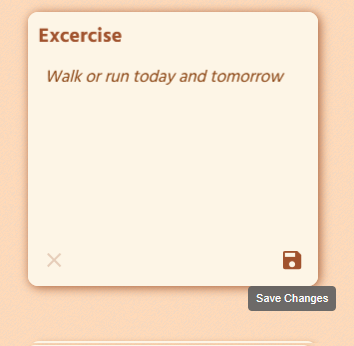

# 📝 icp-note-take


**icp-note-take** is a responsive note-taking application built with **React** on the frontend and **Motoko** on the backend, deployed to the **Internet Computer (ICP)**.

It’s a feature-matching rebuild of my earlier [`note-take`](https://github.com/andrewblais/note-take) project, which used a **Node.js/Express backend with a PostgreSQL database**.

- The main difference is that **icp-note-take** stores all data directly on-chain via ICP canisters — eliminating the SQL layer entirely while maintaining core note-taking functionality.
- This shift showcases how a traditional full-stack app can be re-architected for decentralized, serverless deployment without sacrificing responsiveness or usability.

---

## 🔍 Differences from `note-take`

| Feature / Aspect      | `note-take` (Original)             | `icp-note-take` (This Project)                             |
| --------------------- | ---------------------------------- | ---------------------------------------------------------- |
| **Backend**           | Node.js + Express                  | Motoko (ICP Canister)                                      |
| **Database**          | PostgreSQL (via pgAdmin)           | On-chain storage via stable variables                      |
| **Hosting**           | Local dev / AWS EC2 + S3 planned   | Internet Computer (dfx deploy)                             |
| **API Integrations**  | Dad Jokes API + Quotes API         | Dad Jokes API only (Quotes removed due to ICP CORS limits) |
| **Persistence Layer** | Relational DB tables & SQL queries | In-memory data persisted with stable vars                  |
| **Deployment Flow**   | Node server + React build          | Canister backend + asset canister frontend                 |
| **Goal**              | Bootcamp capstone (AWS target)     | Learning ICP/Motoko & decentralized deployment             |
| **Theming**           | Warm CSS theme in `App.css`        | Default styling (will inherit AWS theme later)             |

---

## 📚 Table of Contents

- [Screenshots](#-screenshots)
- [Installation](#-installationgetting-started)
- [Project Structure](#-project-structure)
- [Reflections & Lessons](#-reflections--pain-points)
- [Resources](#-resources)
- [Author](#-andrew-blais)

---

## 🖼 Screenshots

#### 🖥 Desktop View (Firefox)


#### 📱 Mobile Display


#### 🎭 Add a Joke


#### 🎭 Edit a Note


#### 🎭 Save After Editing



#### 🗑 Delete All Notes


#### 🗑 Delete A Single Note


#### ↕️ Sort Four Ways


---

## 🚀 Installation/Getting Started

> ⚠️ This project runs on the **Internet Computer** via `dfx`. No SQL database is used.

### Prerequisites

- [Node.js](https://nodejs.org)
- [dfx SDK](https://internetcomputer.org/docs/current/references/cli-reference/dfx)
- [VS Code](https://code.visualstudio.com)

### 1. Install Dependencies

```bash
npm install
```

### 2. Start the Local Replica

```bash
dfx start --background
```

### 3. Deploy Canisters Locally

```bash
dfx deploy
```

### 4. Access the App

`dfx deploy` will print the local URL (usually `http://127.0.0.1:4943/?canisterId=...`).

---

## 🗂 Project Structure

```
icp-note-take
├── .env
├── .gitignore
├── LICENSE
├── README.md
├── package.json
├── src/
│   ├── icp-note-take-backend/
│   │   └── main.mo
│   └── icp-note-take-frontend/
│       ├── index.html
│       ├── public/
│       │   ├── pencil_120.png
│       │   └── pencil_32.ico
│       └── src/
│           ├── App.css
│           ├── App.jsx
│           ├── assets/images/
│           ├── components/
│           │   ├── AllNotes.jsx
│           │   ├── DeleteAllButton.jsx
│           │   ├── Footer.jsx
│           │   ├── formatDate.js
│           │   ├── Header.jsx
│           │   ├── NewNote.jsx
│           │   ├── OneNote.jsx
│           │   ├── RadioSortButton.jsx
│           │   └── RadioSortButtons.jsx
│           ├── data/
│           │   └── exampleNotes.js
│           └── main.jsx
└── vite.config.js
```

---

## 🧠 Reflections & Pain Points

### Things I Learned

- Motoko’s type system is stricter than JavaScript, but that leads to fewer runtime surprises.
- Replacing PostgreSQL with stable variables changes how you think about persistence and data modeling.
- ICP canister deployment has a very different dev cycle from a traditional Node + DB stack.
- CORS restrictions on ICP mean some APIs are inaccessible without an intermediary — hence [quote](https://github.com/andrewblais/note-take#-add-a-quote) removal.
- The Internet Computer offers built-in asset hosting, so no need for a separate S3 bucket.

---

## 📦 Resources

- [Internet Computer Docs](https://internetcomputer.org/docs/home)
- [Motoko Base Library](https://internetcomputer.org/docs/motoko/base/)
- [React](https://react.dev/)
- [Vite](https://vite.dev/)
- [icanhazdadjoke API](https://icanhazdadjoke.com/api)
- [ChatGPT](https://openai.com/index/chatgpt/)
- [MDN Web Docs](https://developer.mozilla.org/en-US/)
- [Stack Overflow](https://stackoverflow.com/)

---

_If you see a broken or unclear chunk of code, please open an issue or pull request._

---

_Andrew Blais, Boston, Massachusetts_

📖 Student of Full-Stack Web Development, Machine Learning, Software Engineering and AI Safety & Alignment

🏠 Boston, Massachusetts

🔗 [GitHub](https://github.com/andrewblais) | [Portfolio](https://andrewblais.dev)
